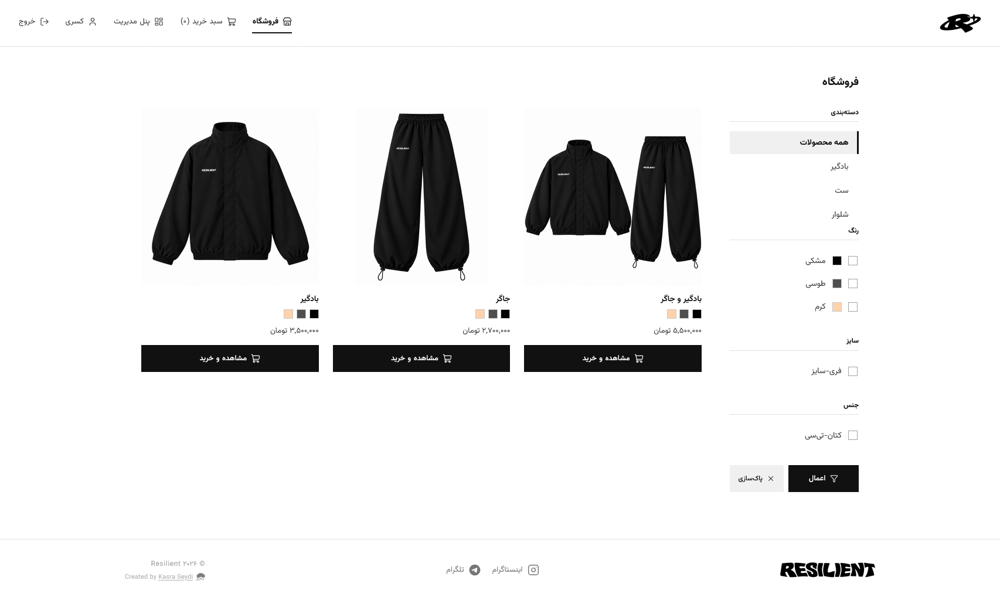
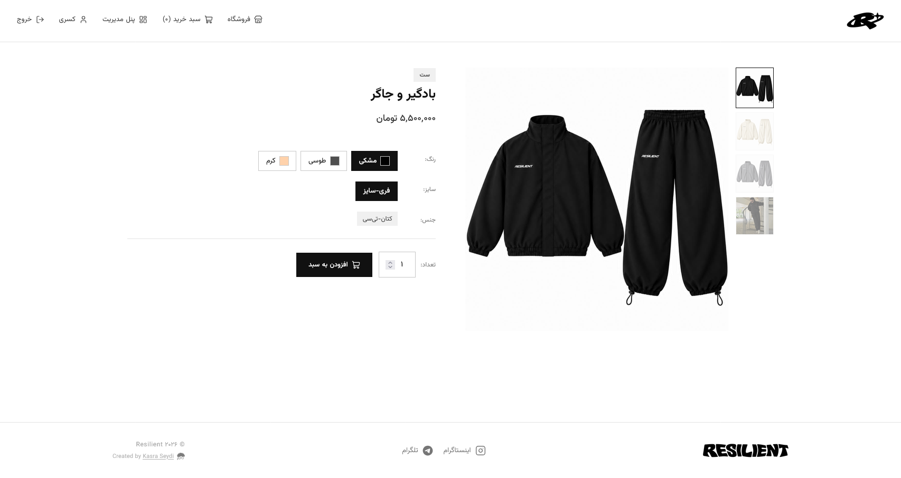
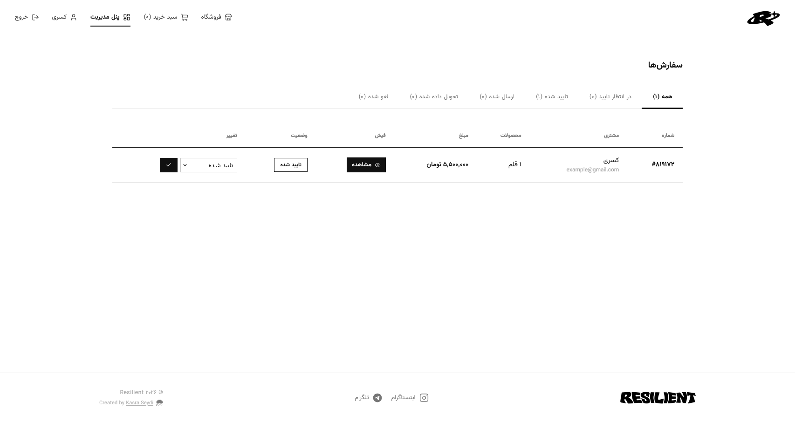
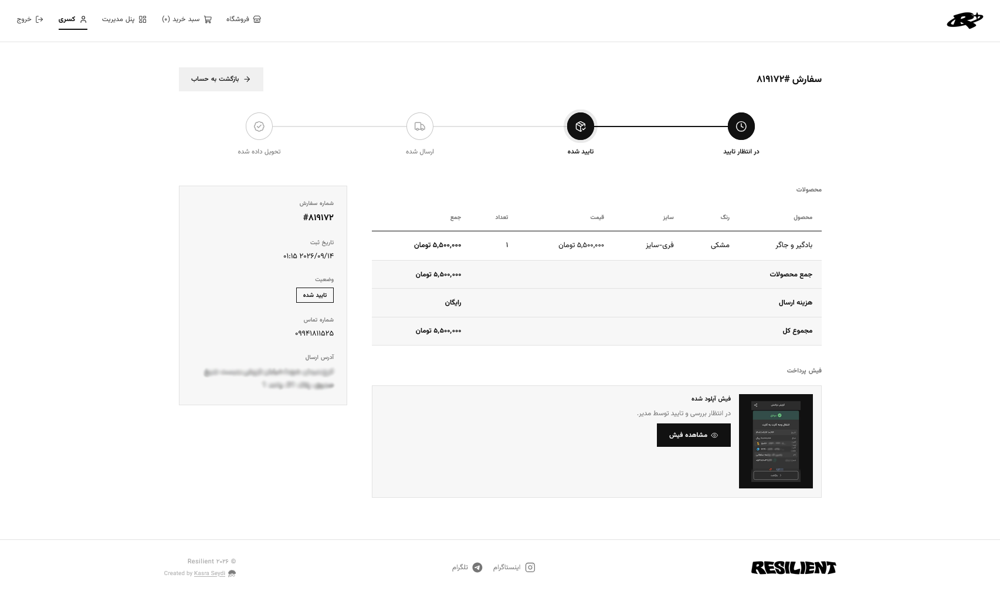

# Resilient

**A Persian e-commerce platform for a modern clothing brand.**

[resilient.ir](https://resilient.ir) · Closed Source · Maintained by [Kasra Seydi](https://kasra-seydi.ir)

---

## Overview

Resilient is a full-stack e-commerce platform built for an Iranian clothing brand. It provides a complete shopping experience in Persian, from product discovery through order fulfillment, alongside a dedicated administrative panel for managing the store.

The platform was built from scratch without a framework, using vanilla PHP and MySQL. Every layer (routing, authentication, session-based cart, order lifecycle, notifications, image handling, and admin tooling) was implemented directly to keep the codebase lightweight, portable, and easy to deploy on low-cost shared hosting.

---

## Features

### Storefront
- Persian RTL interface with responsive layout for desktop, tablet, and mobile
- Product catalog with category and attribute-based filtering (color, size, material)
- Filter panel presented as a slide-in drawer on mobile
- Multi-image product galleries with automatic image cycling (hover on desktop, timed on mobile)
- Session-based shopping cart with variant support (color and size per item)
- User registration and login via email or mobile number
- Account dashboard with editable profile, saved address, and order history
- Order tracking page with a visual status timeline (pending, confirmed, shipped, delivered)

### Checkout and Payments
- Address validation with account-level persistence
- Configurable shipping cost with free-shipping support
- Manual bank transfer flow with required payment receipt upload
- Receipt images stored and reviewed by administrators during order approval
- Copy-to-clipboard for the payment card number

### Notifications
- In-app notification system with a bell menu in the header and a full notifications page
- Per-user read state, individual deletion, and bulk clear
- Automatic notifications on order placement (to admins) and order status changes (to customers)
- Welcome notification on account registration
- Login notifications that include the detected device (OS and browser)
- Optional browser push notifications using the Web Notifications API
- One-time permission prompt shown after registration, with a persistent banner on the notifications page

### Admin Panel
- Full CRUD for products, categories, and attributes
- Product availability toggle (available / unavailable) in place of stock counting
- Per-product discount percentage with an additional store-wide discount layer
- Configurable shipping cost, payment card details, and contact links
- Order management with status updates and receipt verification
- Lightbox viewer for customer-uploaded payment receipts
- Custom confirmation modals for all destructive actions
- Manual and automatic cleanup of unused uploads and expired receipts

### Infrastructure
- Mobile-first responsive design across the storefront and admin panel
- Automatic image upload handling with MIME validation
- Session-based authentication using hashed passwords
- CSRF-safe form handling through POST-only mutations and session state
- Structured data (JSON-LD) and OpenGraph metadata for search and social embeds
- SEO fundamentals: sitemap, robots.txt, canonical URLs, per-page metadata, and cache-busting asset URLs

---

## Tech Stack

| Layer            | Technology                            |
| ---------------- | ------------------------------------- |
| Backend          | PHP 8.x (procedural, no framework)    |
| Database         | MySQL (PDO with prepared statements)  |
| Frontend         | HTML5, CSS3, vanilla JavaScript       |
| Icons            | Lucide                                |
| Typography       | Vazirmatn                             |
| Hosting          | Shared Linux hosting (Apache)         |

---

## Architecture

The application follows a straightforward, framework-free structure:

- **`config.php`** : global configuration and auto-detected base URL
- **`db.php`** : PDO database connection
- **`functions.php`** : shared helpers (auth, cart, pricing, uploads, notifications, cleanup)
- **`header.php` / `footer.php`** : shared layout, metadata, and client scripts
- **`admin/`** : isolated admin panel, protected by role checks
- **`uploads/`** : user-uploaded images (product galleries and payment receipts)
- **`cleanup.php`** : on-demand and automatic cleanup of unused files

Authentication uses PHP sessions with hashed passwords (`password_hash` / `password_verify`). All database queries use prepared statements. Admin routes verify the authenticated user's role before rendering.

---

## Screenshots

| Storefront | Product Page |
| ---------- | ------------ |
|  |  |

| Admin Orders | Order Tracking |
| ------------ | -------------- |
|  |  |

---

## Status

Resilient is live and actively maintained at **[resilient.ir](https://resilient.ir)**.

The source code is closed. This repository exists as a public reference for the project's scope, architecture, and feature set.

---

## About

Designed and developed by **Kasra Seydi**.

- Website: [kasra-seydi.ir](https://kasra-seydi.ir)
- Contact: contactme@kasra-seydi.ir

For inquiries about the project or collaboration opportunities, please reach out through the website above.