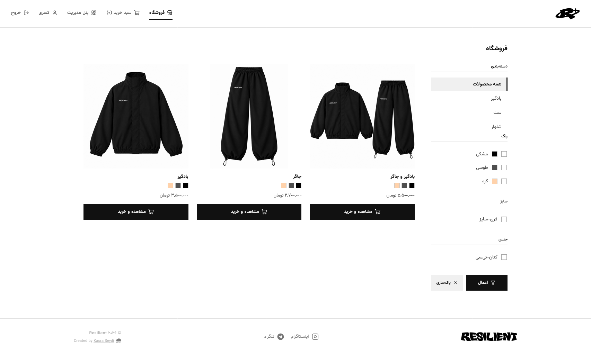
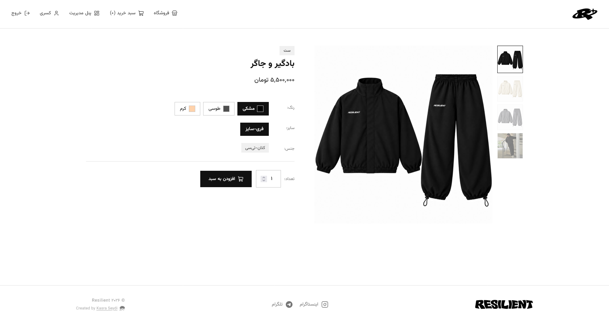
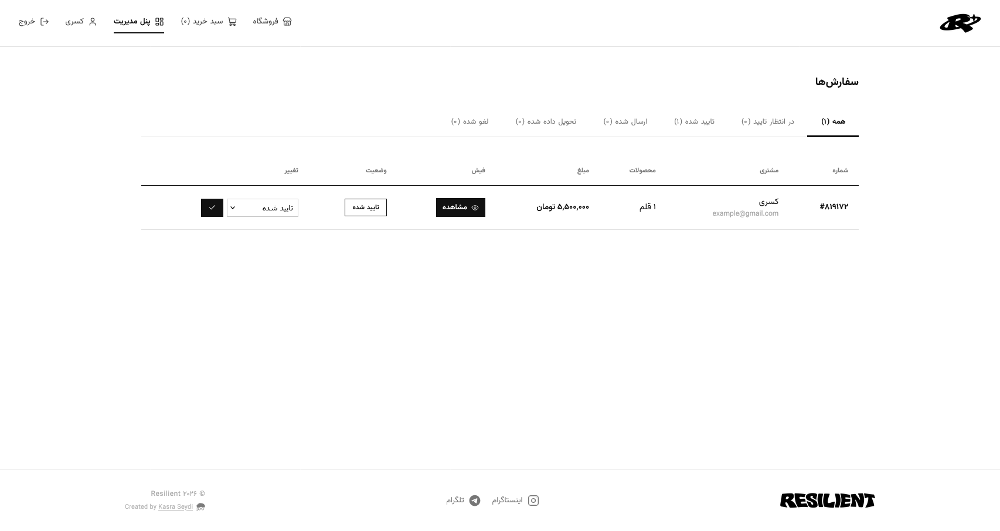
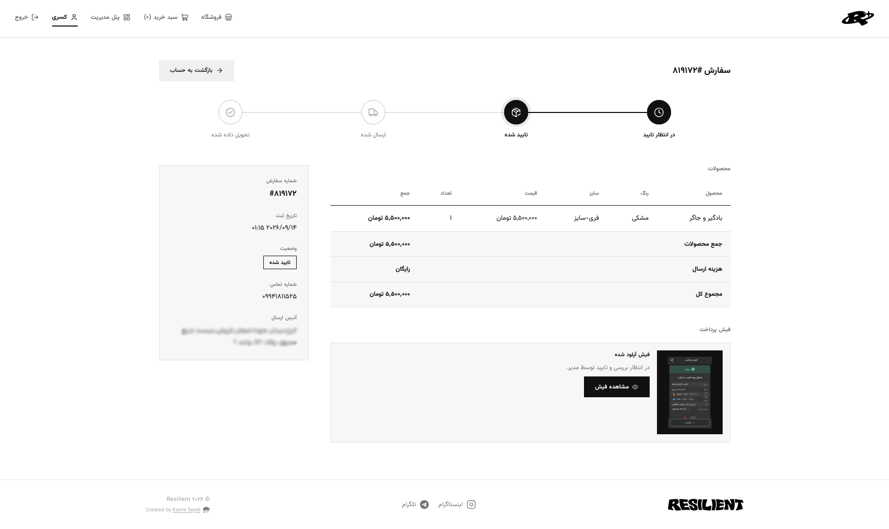

# Resilient

**A Persian e-commerce platform for a modern clothing brand.**

[resilient.ir](https://resilient.ir) · Closed Source · Maintained by [Kasra Seydi](https://kasra-seydi.ir)

---

## Overview

Resilient is a full-stack e-commerce platform built for an Iranian clothing brand. It provides a complete shopping experience in Persian, from product discovery through order fulfillment, alongside a dedicated administrative panel for managing the store.

The platform was built from scratch without a framework, using vanilla PHP and MySQL. Every layer (routing, authentication, session-based cart, order lifecycle, notifications, analytics, image handling, and admin tooling) was implemented directly to keep the codebase lightweight, portable, and easy to deploy on low-cost shared hosting.

---

## Features

### Storefront
- Persian RTL interface with responsive layout for desktop, tablet, and mobile
- Product catalog with category and attribute-based filtering (color, size, material)
- Instant filter updates via AJAX with no page reload
- Filter panel presented as a slide-in drawer on mobile
- Multi-image product galleries with automatic image cycling (hover on desktop, timed on mobile)
- Session-based shopping cart with variant support (color, size, and texture per item)
- User registration and login via email or mobile number
- Persistent login via remember-me tokens (30-day rolling session)
- Account dashboard with editable profile, saved address, gender, and preferred size
- Order tracking page with a visual status timeline (pending, confirmed, shipped, delivered)

### Product Variants
- Global color library with hex values
- Size attributes with support for free-size products
- Global texture library for pattern-based products (camo, plaid, striped, etc.)
- Per-product attribute assignment with checkboxes
- Attributes stored as a many-to-many relation

### Checkout and Payments
- Address validation with account-level persistence
- Configurable shipping cost with free-shipping support
- Shipping time notice displayed on checkout and cart
- Discount code system with per-code expiry, usage limits, and percentage value
- Manual bank transfer flow with required payment receipt upload
- Receipt images stored and reviewed by administrators during order approval
- Copy-to-clipboard for the payment card number

### Notifications
- In-app notification system with a bell menu in the header and a full notifications page
- Per-user read state, individual deletion, and bulk clear
- Automatic notifications on order placement (to admins) and order status changes (to customers)
- Welcome notification on account registration
- Login notifications that include the detected device (OS and browser)
- Optional browser push notifications using the Web Notifications API
- One-time permission prompt shown after registration, with a persistent banner on the notifications page

### Admin Panel
- Full CRUD for products, categories, and attributes
- Multi-category assignment per product
- Product availability toggle (available / unavailable) in place of stock counting
- Per-product discount percentage with an additional store-wide discount layer
- Discount code manager with expiry tracking, use counts, and copy-to-clipboard codes
- Global texture library with image uploads and usage counts
- Configurable shipping cost, payment card details, and contact links
- Order management with status updates and receipt verification
- Lightbox viewer for customer-uploaded payment receipts
- Custom confirmation modals for all destructive actions
- Analytics dashboard with order stats, user stats, revenue, and visitor charts
- Manual and automatic cleanup of unused uploads, expired receipts, and expired remember-me tokens

### Analytics
- Total orders, users, and revenue with today/7-day breakdowns
- Unique visitor chart with 24h, 7d, 30d, and 1y range filters
- Animated transitions between chart ranges
- Gender distribution bar with male/female split
- Automatic exclusion of admins, developers, and bots from statistics

### Infrastructure
- Mobile-first responsive design across the storefront and admin panel
- Automatic image upload handling with MIME validation
- Client-side image compression (WebP conversion for products and receipts)
- Server-side image resizing with quality profiles per asset type
- Session-based authentication using hashed passwords
- Remember-me tokens using the selector/validator pattern with rotation on use
- Rate limiting on login and registration
- CSRF-safe form handling through POST-only mutations and session state
- Structured data (JSON-LD) and OpenGraph metadata for search and social embeds
- SEO fundamentals: sitemap, robots.txt, canonical URLs, per-page metadata, and cache-busting asset URLs

---

## Tech Stack

| Layer            | Technology                            |
| ---------------- | ------------------------------------- |
| Backend          | PHP 8.x (procedural, no framework)    |
| Database         | MySQL (PDO with prepared statements)  |
| Frontend         | HTML5, CSS3, vanilla JavaScript       |
| Charts           | Chart.js                              |
| Icons            | Lucide                                |
| Typography       | Vazirmatn                             |
| Hosting          | Shared Linux hosting (Apache)         |

---

## Architecture

The application follows a straightforward, framework-free structure:

- **`config.php`** : global configuration, session, and remember-me constants
- **`db.php`** : PDO database connection and auto-login via remember-me cookie
- **`functions.php`** : shared helpers (auth, cart, pricing, uploads, notifications, analytics, cleanup)
- **`header.php` / `footer.php`** : shared layout, metadata, and client scripts
- **`index.php` / `filter-products.php`** : shop page and AJAX filter endpoint
- **`product.php` / `cart.php` / `checkout.php`** : product detail, cart, and checkout
- **`admin/`** : isolated admin panel, protected by role checks
- **`uploads/`** : user-uploaded images (products, textures, receipts)
- **`cleanup.php`** : on-demand and automatic cleanup of unused files and expired data

Authentication uses PHP sessions with hashed passwords (`password_hash` / `password_verify`). Persistent login uses long-lived remember-me tokens stored in a dedicated table, rotated on each use. All database queries use prepared statements. Admin routes verify the authenticated user's role before rendering.

---

## Database Schema

The schema is organized around a small set of core entities:

- **`users`** : accounts with role, contact info, location, gender, and preferred size
- **`products`** : catalog entries with pricing, discounts, and availability
- **`categories`** : shop sections
- **`product_categories`** : many-to-many link between products and categories
- **`product_images`** : ordered hover images per product
- **`attributes`** : global library of colors, sizes, and materials
- **`product_attributes`** : many-to-many link between products and attributes
- **`textures`** : global library of pattern images
- **`product_textures`** : many-to-many link between products and textures
- **`orders` / `order_items`** : customer orders with per-item snapshots and status history
- **`notifications`** : per-user messages with read state
- **`remember_tokens`** : persistent login tokens
- **`discount_codes`** : percentage codes with expiry and usage limits
- **`page_views`** : anonymized visitor tracking for analytics
- **`settings`** : global key/value store for site configuration

---

## Screenshots

| Storefront | Product Page |
| ---------- | ------------ |
|  |  |

| Admin Orders | Order Tracking |
| ------------ | -------------- |
|  |  |

---

## Status

Resilient is live and actively maintained at **[resilient.ir](https://resilient.ir)**.

The source code is closed. This repository exists as a public reference for the project's scope, architecture, and feature set.

---

## About

Designed and developed by **Kasra Seydi**.

- Website: [kasra-seydi.ir](https://kasra-seydi.ir)
- Contact: contactme@kasra-seydi.ir

For inquiries about the project or collaboration opportunities, please reach out through the website above.